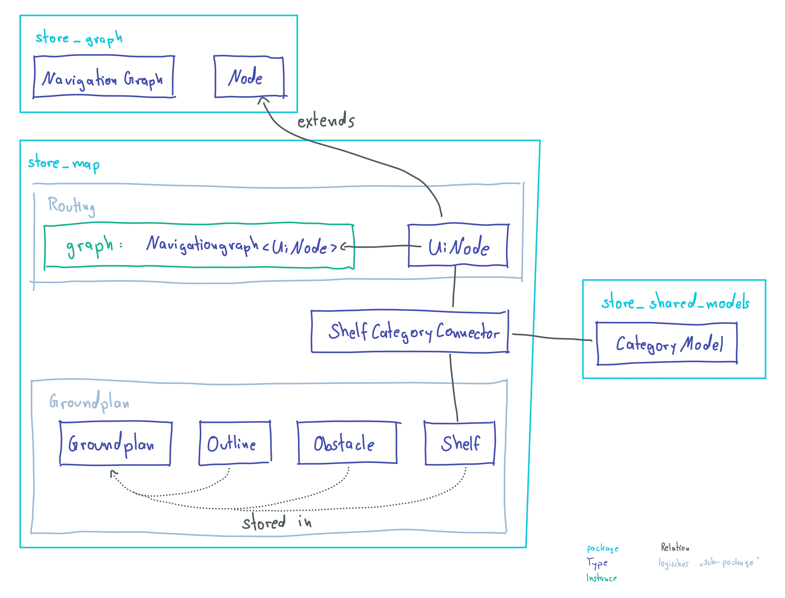

Flutter package, that displays a store map and its routing.
Using flutter flame and store_navigation_graph

## Features

- [x] Show a map of the store
- [x] "Move" through the store using the typical gestures
- [ ] Improve scaling with gesture input
- [x] Show debug information about the graph when `kDebugMode`
- [x] Show route to category / categories
- [x] Public API to control this package from outside
- [x] Connect shelves with catgories

## Getting started

### Usage

A working example is in the `example` folder.
There is just one mandatory field for the navigation map, which is the `groundplan`. The groundplan is an object which contains all information like the outline of the store, the shelfs and the navigation graph, which you need to initialize as seen here: [store_navigation_map](https://github.com/ShoppingNavigation/navigation_graph#readme). The only change you have to do is use `UiNode` instead of `Node`. The `UiNode` also has a field for the position of the node.

```dart
NavigationMap(
    groundplan: GroundPlanModel(
        graph: NavigationGraph<UiNode>(...)
        outline: GroundPlanOutlineModel(vertices: <Vector2>[])
        shelves: <GroundPlanShelfModel>[
            position: Vector2(...),
            vertices: <Vector2>[],
            connector: ShelfCategoryConnector(
                position: Vector2(...),
                category: CategoryModel(...),
                node: UiNode(...),
            ),
        ],
        obstacles: <GroundPlanObstacleModel>[
            position: Vector2(...),
            vertices: <Vector2>[],
        ],
    ),
);
```

Added to that, you need to provide the `RoutingCubit` to a top level bloc-provider. Using that cubit you can either route to a sinlge category:

```dart
context.read<RoutingCubit>().routeTo(start, category);
```

or to multiple nodes in one go:

```dart
context.read<RoutingCubit>().routeToAll(start, [category1, category2]);
```

The current state of routing is saved in the `RoutingState`. This state can be either in `Initial, SingleRoute, MultiRoute or Finished`.
To use the admin view (pick a category), you also need to add the `adminActive` and `onShelfSelected` fields to the widget. Using only one of them wont work. As soon as the user picks a shelf, the `onShelfSelected` method gets called.

### Additional things:

- You also need to add location permissions to ios and android
- Add code to AppDelegate.swift to get the notifications to work:
```swift
FlutterLocalNotificationsPlugin.setPluginRegistrantCallback { (registry) in
    GeneratedPluginRegistrant.register(with: registry)
}

if #available(iOS 10.0, *) {
    UNUserNotificationCenter.current().delegate = self as UNUserNotificationCenterDelegate
}
```
- Add `await NotificationHelper.setup()` to main method before `runApp()`

## About the structure

The most important part of this package is the connection between a shelf (category) and a node in the graph. Because this is split into 3 different packages (category: store_navigation_map, node/graph: store_navigation_graph, shelf: store_navigation_map), we need to add some glue code. The structure is also shown in the image below.
A new field connector of type `ShelfCategoryConnector` is added to a shelf. This provides a position to which the `NavigationGraph` can connect to. The routing is done to the node, that is also given in the connector.



### Debug view
Everything debug related should be in the `/debug` folder. To show the whole graph for debugging purposes, you just need to add `DebugGraph` Component to the MapContainer. The Debugview should never be shown to a customer.
